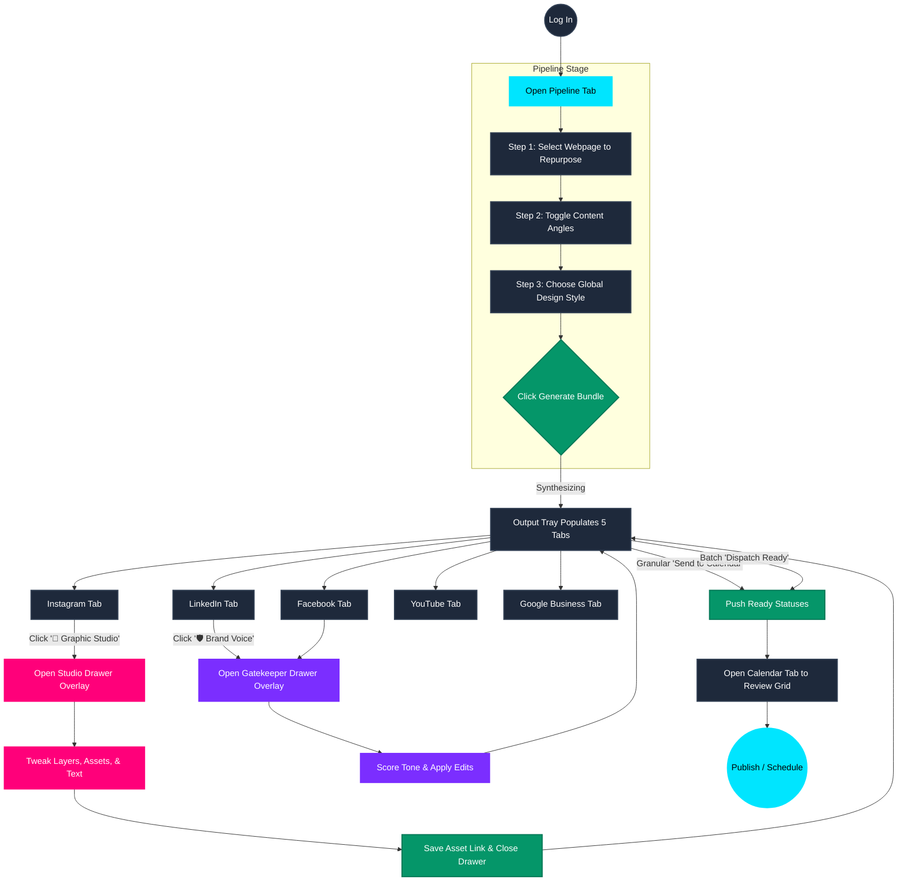

# AEObility Social Calendar User Flow

This document maps out the core user journey, starting from the **Repurposing Pipeline**, through generation, styling, auditing, and finally dispatching to the content calendar.

## 🗺️ User Flow Diagram

## 🚶 Step-by-Step Walkthrough

**1. The Setup (Pipeline)**
* The user lands on the **Pipeline** tab.
* They select an existing Knowledge Base article (e.g., a whitepaper or blog post) from the "Source Link" dropdown.
* They click the **Content Angle** pills (e.g., "Vector Chunking", "Lost-in-the-Middle") to steer the AI's focus.
* They select a global **Design Style** (e.g., "Style A: Dark Cinematic"). Note: Aspect ratios are no longer global; they adapt automatically per channel.

**2. The Generation (Output Tray)**
* The user hits the big **Generate 5-Channel Bundle** button.
* After a few seconds, the Output Tray populates with 5 separate tabs containing platform-optimized copy for LinkedIn, Instagram, Facebook, YouTube, and Google Business.

**3. The Polish (Inline Overlay Drawers)**
* **Graphics:** The user clicks **"🎨 Graphic Studio"** on the Instagram tab. A slide-over drawer opens *without leaving the pipeline*, pre-loading their exact text, global design style, and the channel's optimal aspect ratio (4:5). They tweak the layout, hit Save, the drawer closes, and they are back exactly where they were in the pipeline.
* **Copy:** The user clicks **"🛡️ Brand Voice"** on the LinkedIn tab. The Gatekeeper drawer slides over, scoring the text and suggesting inline edits. Applying edits updates the main pipeline state.

**4. The Dispatch (Granular & Batch)**
* Instead of a rigid "Send All" action, users can hit **"Send to Calendar"** on individual ready channels.
* Or, they use the master status bar at the bottom to bulk **"Dispatch Ready (X/5)"**.
* Finally, they navigate to the **Calendar & Dispatch** tab to see their new posts neatly organized in a Kanban or list view, ready for final approval.
